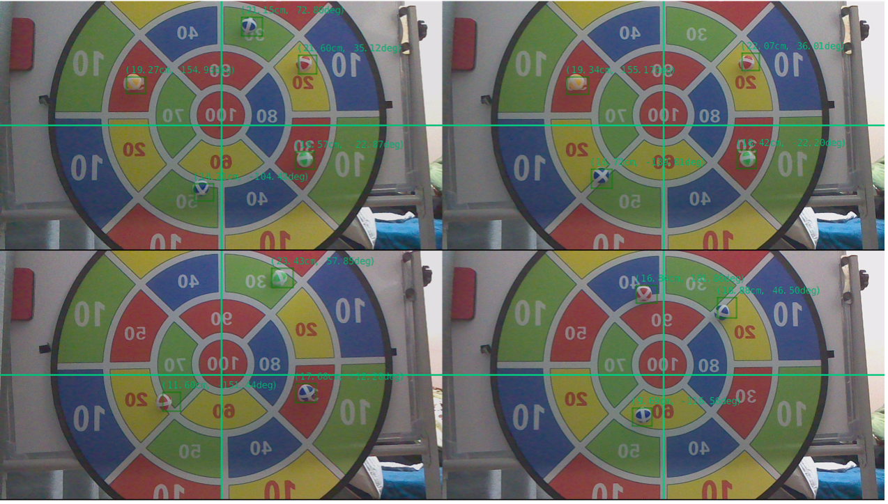

# Object Detection on Jetson Nano B01

This is the source code for a course design having a objective of detecting the coordinate of the toy ball on the target.

## Preparation

Following the official [tutorial](https://github.com/dusty-nv/jetson-inference) to set up the device and collecting the data.

## Calibration

Measure the distance between the camera and the target d1 and the distance between the origin and any single ball on the target.

Then, run:

```
python detection.py --calib1 d1 d2
```
which produces the focal length f.

## Detection

```
python detection.py --calib2 f d1
```

For more arguments information, run `python detection.py -h`.


